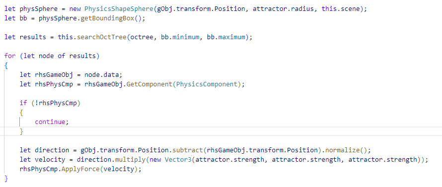

# Technical Document

## Scene : Physics

### Description
This scene features a ball at the centre of the scene that pulls in all physics objects that surround it.
The scene is comprised of one sphere mesh and 2000 cubes. While most cubes will converge at the centre where the sphere resides,
others will orbit around the centre of gravity which makes for an interesting scene to observe. 
The polarity of the sphere can be switched by clicking on it - doing to will cause all boxes to be repelled.

There is a boundary on the outer edges of the map. 
However, sadly the colliders on each boundary object do not appear to function - and I haven't been able to figure out why prior to submission. This merely means that if the boxes fall outwith the sphere of influcence of the 'star' object - then the only way to get them back is to reset the scene.

### GameObjects & Components
Game objects (or Entities) are the means by which I abstract access to nodes within BabylonJS. Game objects will comprise of one to any number
of components which govern the objects behaviour throughout the application, not unlike Unity or any other ECS framework. Their implementation falls outwith the scope of this document. 
This segment is simply  to let you know that I make use of these objects and components throughout every game / scene I have done. 

### PhysicsGame.ts & Game.ts
PhysicsGame is the class that is responsible for the initialisation and running of the 'physics' scene. It extends the Game class which plays home to the majority of the systems that are at play (but again, fall outwith the scope of this document). However, here is a UML showing a brief outline of all game classes.

### PhysicsGame - Initialisation

The initialisation method of this class calls 'seupScene' which (funnily enough) is reponsible for setting up the scene for this game. The setup of the scene is broken up to three sections - I will be walking you through the 'createObjects' function. The other two functions are equally self explanitory - one creates the scene camera, and the other creates the scene boundaries.

Of the first things we do in createObjects is create the sphere that takes centre stage at the start of the scene. The one and only parameter the 'createLargeSphere' function takes is the position. I want the sphere to spawn in the centre of the scene so I simply pass in Vector3.Zero(). The only other thing I do at the begining of this function is specify start and the end positions. This is to define the range or area objects will spawn in - and it is used later.

The first thing I do is create a new game object using the game object factory, specifying both the shape type and position, before settings its scale. I then create two components :
- PhysicsAttractor
    - Responsible for storing the strength and radius of the game object's pull.
- PhysicsComponent
    - Responsible for storing the all of the physics attributes and data for the game object.

Once initialised to my liking, I add both components to the game object that was just created. I then set the colour of the game object, and return out of that function with the object as its result.

Next : I create the 2000 *(or whatever count is specified)* objects to fill the scene with.

At the start of each itteration, I create a random position and velocity for the object that is about to be created. I then create the object, setting its position, shape type, and later - scale. Each new game object is created with a MeshComponent which holds attributes governing the object's mesh. I use them to set the desired colour of each cube *(black, in this case)*.

I create a new physics component for the shape, assigning its type and mass before adding that component to the game object. The last thing I do on each itteration is set apply the random velocity to the physics component using *ApplyImpulse()*. This ensures that each cube will not only have a randomly generated position, but a randomly generated velocity to boot.

This concludes the initialisation of the scene.

### PhysicsSystem - Update

The rest of the interesting magic happens within the update loop of the physics system. A seperate class that was made for handling the physics interactions of the game. What I haven't mentioned up until now is that each new game object created using the game object factory is automatically added onto the games' systems, and each system handles its own domain for every game object that has been registered with it.

The first thing the physics system does each and every update is construct a spatial partitioning tree known as an oct tree such that we may query what game objects are within any two given positions. The update method then begins looping through every game object that has been registered and ensures that the object has all of the following components before progressing any further :
- A mesh component
- A physics component
- A physics atttractor

I also check to ensure that the attractor has both a strength and a radius - there's no point carrying out expensive processing for something that you know will yield zero output.

In order to be able to use the search tree, I first had to convert the spherical shape of the physics attractor into a bounding box *(a minor concession of accuracy for performance)*. I then query the tree for which game objects exist within this attractors sphere of influence. Itterating through the result, I check if the object has a physics component associated with it before continuing as I cannot effect something that the physics engine does not know about.

I calculate the direction vector between the attractor and the current game object and apply a force onto the game object according to the pull *(or repulsive)* strength of the attractor. 

### Conclusion

I had planned on making the scene more configurable for the end user such that they could modify how many cubes were to be spawned, or how many stars were to be in the scene, but couldn't find the time to do so.

When using the oct tree there is an up-front performance cost when initialising / setting it up -  but it does a good job of culling data that needn't be itterated over later. Being limited on time - I didn't want to create my own version of the data structure in typescript - and simply wanted an implementation that worked off the bat, and as such found 'd3-octree' on [NPM](https://www.npmjs.com/package/d3-octree)

